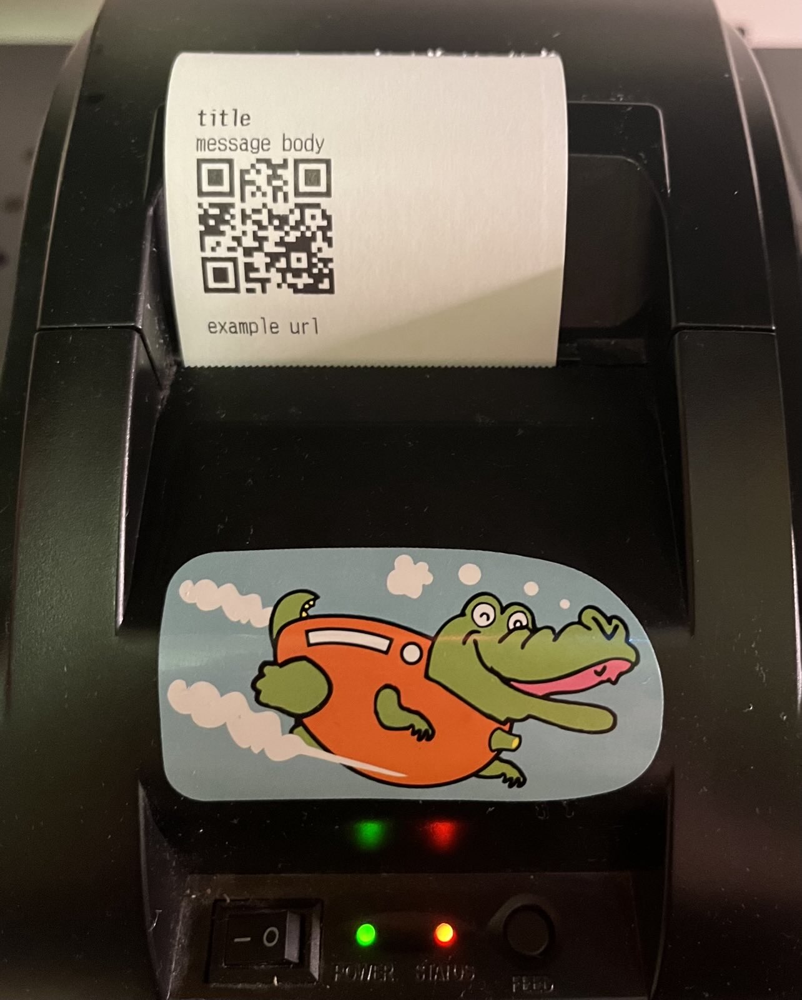

# Setup
1. copy `sample.env` to `.env`
2. set the variables `NAME` and `PRINTER` in `.env`
3. run `env EMAIL=[email] PASSWORD=[password] client.js` for initial setup
4. on future invocations, simply run `client.js`
5. send a test notification via [pushover.net](https://pushover.net/) or by running `example.js`

