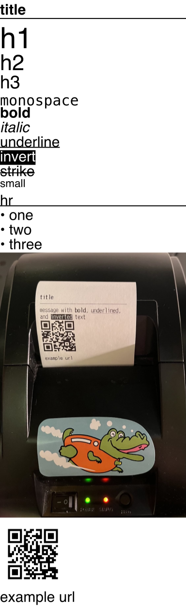

# Setup
1. copy `sample.config.json` to `config.json` and set each variable as needed
2. run `npm run start`
3. send a test notification via [pushover.net](https://pushover.net/) or by running `npm run notify`

